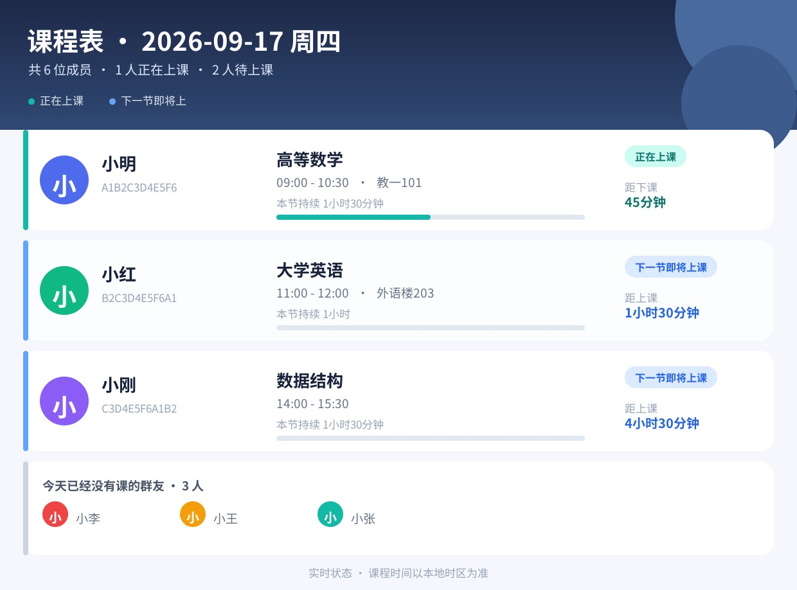
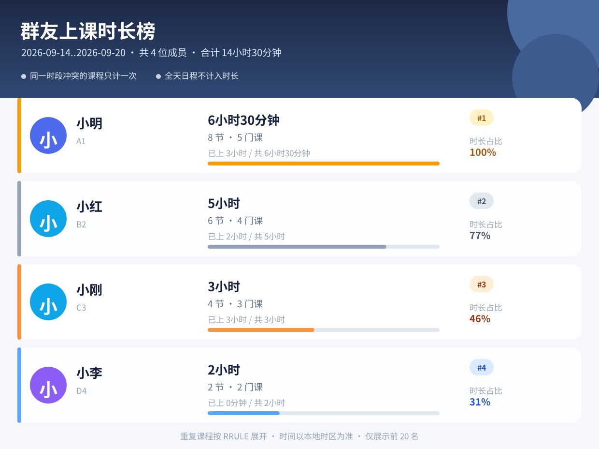

# qqbot-course-schedule

基于 **QQ 官方机器人 API v2 + Go** 的独立课表机器人。

功能抽象自 [astrbot_plugin_CourseSchedule](https://github.com/mico-v/astrbot_plugin_CourseSchedule)，
框架思路参考 [Polarix](https://github.com/YearnstudioYangyi/Polarix)，不依赖 AstrBot / OneBot / NapCat。

## 项目文档

| 文档 | 内容 |
| --- | --- |
| [PLAN.md](PLAN.md) | 项目计划：功能抽象、里程碑与进度、验收标准、风险、决策记录 |
| [DEV-GUIDE.md](DEV-GUIDE.md) | 开发手册：环境、目录结构、配置、编码规范、测试、部署、FAQ |
| [CONNECT.md](CONNECT.md) | 接入清单：平台配置、服务器配置、验证步骤、主动推送与按钮说明 |
| [COVERAGE-AstrBot.md](COVERAGE-AstrBot.md) | QQ 官方 API v2 × AstrBot 适配度研究 |

`docs/` 只存放抓取的 **QQ 官方文档快照**（[索引](docs/INDEX.md)），不混入本项目文档。

## 快速开始

```bash
cp config.example.json config.json   # 填写 appid / secret
go run ./cmd/bot                     # 默认监听 127.0.0.1:18080，回调路径 /webhook
curl -s localhost:18080/healthz      # {"ok":true,"version":"dev"}
```

卡片预览（开发用）：`go run ./cmd/cardpreview -o /tmp/card.jpg`（`-rank` 预览榜单）。





## 已实现功能

| 类别 | 内容 |
| --- | --- |
| 课表 | `/今日课表` `/明日课表` `/课表 [日期]`（全部图片输出，状态/倒计时/收纳条带） |
| ICS | `/导入课表`（附件自动导入，支持 RRULE/RDATE/EXDATE、GBK/UTF-16、嵌套 VALARM）、`/导出课表 [成员]` |
| 榜单 | `/上课时长榜`（别名 `/上课排行` `/本周上课排行` `/学习时长榜`；union 去重、窗口裁剪） |
| 休假调休 | `/休假` `/调休` `/销假` `/假期`（别名齐全，管理员默认全体，普通成员限自己，支持 @） |
| 头像 | `/绑定QQ <QQ号>` `/解绑QQ` 自助绑定，或管理员在 WebUI 填 QQ 号；卡片改用 qlogo 公开头像（24h 磁盘缓存，失败回退昵称首字底色） |
| 推送 | `/启用推送` `/关闭推送` `/推送时间 [HH:MM\|cron\|默认]` `/推送测试`；默认每天 07:30，可逐会话自定义，无权限自动暂停 |
| 平台交互 | 指令面板（c2c + group，自动包含全部 Ready 指令）、自定义菜单、卡片按钮框架（`buttons`，内邀能力默认关闭） |
| 机器人设置 | `/设置`（管理员/私聊）或 WebUI「设置」：总开关 + 回复策略（无斜杠 / 斜杠 / @机器人 分别开关），改完即时生效 |
| Web 管理台 | `/admin`（Basic Auth）按会话/成员增删改课程、批量建空课表（在群里发过言的成员会自动出现在候选列表）、revision 409 冲突提示、批量导入/导出（ICS 压缩包 / 原始备份）、成员页单成员 `.ics` 导入/导出、休假/调休标记管理、机器人设置 |

## 部署

```bash
./deploy/deploy.sh                  # gofmt → go test → 构建 → 上传 → 重启 → 健康检查
./deploy/deploy.sh --caddy          # 同时更新 Caddy 反代（需 CADDY_DOMAIN）
```

接入 QQ 平台的完整步骤见 [CONNECT.md](CONNECT.md)。

## 进度

- [x] 需求调研与官方文档快照
- [x] M0 骨架：webhook 验签 + Op=13 + Token + 文本收发 + 一键部署
- [x] M1 数据与图片：SQLite / ICS / RRULE / 图片渲染
- [x] M2 休假调休 + 上课时长榜
- [x] M3 Web 管理台
- [x] M4 指令面板 / 自定义菜单 / 定时推送 / 按钮框架
- [x] M5 收尾：导出、错误码、文档与测试
- [x] M6 增强：WebUI 批量导入/导出（ICS 压缩包 + 原始备份）
- [x] M7 增强：逐会话推送时间 + WebUI 休假/调休管理
- [x] M8 增强：成员页单成员 .ics 导入/导出
- [x] M10 增强：QQ 号绑定 + 真实头像

## 许可证

待定。功能设计源自作者本人的 AGPL-3.0 项目，框架参考 MIT 项目 Polarix。
